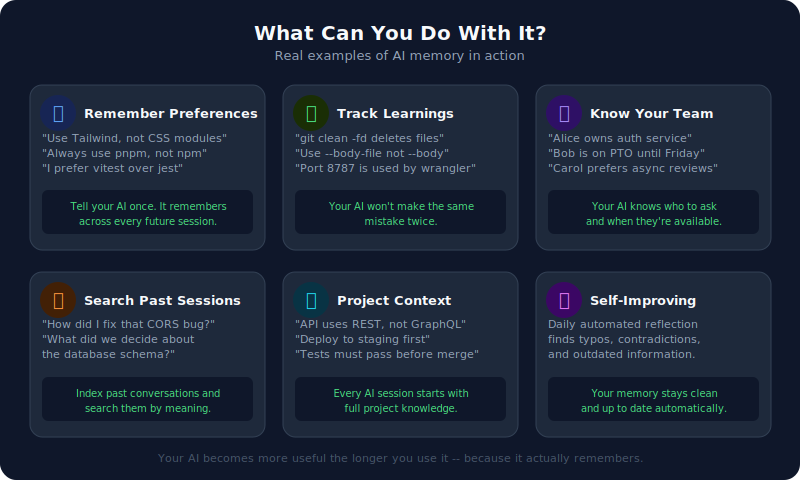
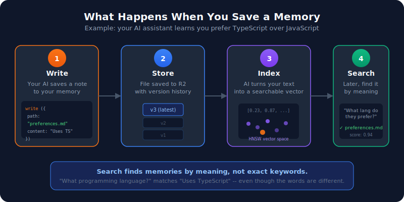
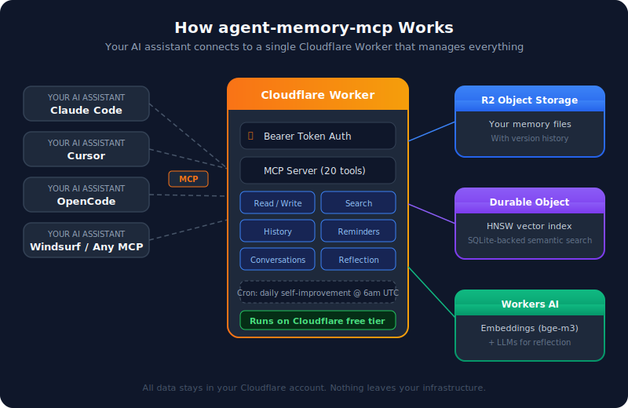

# agent-memory-mcp

**Give your AI coding assistant a long-term memory.**

AI assistants like Claude Code, Cursor, and OpenCode forget everything between sessions. This fixes that. `agent-memory-mcp` is a small server you deploy to your own Cloudflare account that stores memories, searches them by meaning, and keeps them organized -- so your AI gets smarter the longer you use it.

It runs entirely on Cloudflare's free tier. Your data never leaves your account.

[](https://deploy.workers.cloudflare.com/?url=https://github.com/jonnyparris/agent-memory-mcp)

---

## What can you do with it?

<picture>
  <source media="(prefers-color-scheme: dark)" srcset="docs/use-cases.svg">
  
</picture>

**Some real examples:**

- **"Always use pnpm, not npm"** -- Tell your AI once. It remembers in every future session.
- **"How did I fix that CORS bug last week?"** -- Search past conversations by meaning, not keywords.
- **"Alice owns the auth service"** -- Your AI knows who to ask about what.
- **"We decided to use REST, not GraphQL"** -- Project decisions persist across sessions.
- **"Port 8787 is already used by wrangler"** -- Your AI won't make the same mistake twice.

---

## How it works

<picture>
  <source media="(prefers-color-scheme: dark)" srcset="docs/how-it-works.svg">
  
</picture>

1. **Write** -- Your AI saves a note (a preference, a lesson, a decision).
2. **Store** -- The file is saved to R2 with full version history. You can roll back any change.
3. **Index** -- Workers AI turns the text into a vector embedding and adds it to a searchable index.
4. **Search** -- Later, your AI (or you) can find that memory by asking a question in plain English. Semantic search matches by meaning, not exact words.

Recent memories rank higher than old ones automatically.

---

## Architecture

<picture>
  <source media="(prefers-color-scheme: dark)" srcset="docs/architecture.svg">
  
</picture>

Three Cloudflare services, one Worker:

| Component | What it does |
|-----------|-------------|
| **R2** | Stores your memory files with version history |
| **Durable Object** | Runs the HNSW vector index + SQLite for semantic search |
| **Workers AI** | Generates embeddings (bge-m3) and powers the daily reflection |

---

## Quick start

### Option A: One-click deploy

Click the button, follow the prompts, and you'll have a running server in under 2 minutes:

[](https://deploy.workers.cloudflare.com/?url=https://github.com/jonnyparris/agent-memory-mcp)

After deploying, set your auth token:

```bash
npx wrangler secret put MEMORY_AUTH_TOKEN
# Enter a secure random token when prompted
```

### Option B: Clone and deploy manually

```bash
git clone https://github.com/jonnyparris/agent-memory-mcp.git
cd agent-memory-mcp
npm install

# Create your R2 bucket
npx wrangler r2 bucket create agent-memory

# Set your auth token
npx wrangler secret put MEMORY_AUTH_TOKEN
# Enter a secure random token when prompted

# Deploy
npm run deploy
```

---

## Connect your AI assistant

Once deployed, connect your AI assistant to the server. Replace `YOUR_SUBDOMAIN` with your Cloudflare Workers subdomain (find it in the Cloudflare dashboard under Workers & Pages).

### Claude Code

```bash
export MEMORY_AUTH_TOKEN="your-secret-token"
claude mcp add --transport http agent-memory \
  https://agent-memory-mcp.YOUR_SUBDOMAIN.workers.dev/mcp \
  --header "Authorization: Bearer $MEMORY_AUTH_TOKEN"
```

### Cursor

Go to **Settings > MCP Servers > Add**:
- **URL:** `https://agent-memory-mcp.YOUR_SUBDOMAIN.workers.dev/mcp`
- **Headers:** `Authorization: Bearer YOUR_TOKEN`

### OpenCode

Add to `.opencode/opencode.json`:

```json
{
  "mcp": {
    "agent-memory": {
      "type": "remote",
      "url": "https://agent-memory-mcp.YOUR_SUBDOMAIN.workers.dev/mcp",
      "headers": {
        "Authorization": "Bearer {env:MEMORY_AUTH_TOKEN}"
      }
    }
  }
}
```

### Any MCP-compatible client

The server speaks the standard [Model Context Protocol](https://modelcontextprotocol.io/). Any MCP client can connect via HTTP with a Bearer token header.

---

## Available tools

The server exposes 20 MCP tools. Your AI assistant discovers and uses them automatically -- you don't need to call them yourself.

### Core memory

| Tool | What it does |
|------|-------------|
| `read` | Read one file or up to 50 files from memory (pass a string or array of paths) |
| `write` | Save a file (auto-indexes for search) |
| `list` | List files in a directory |
| `search` | Find memories by meaning (semantic search) |
| `history` | See previous versions of a file |
| `rollback` | Restore a file to an earlier version |
| `get_backlinks` | List files that link to a target via `[[wikilinks]]` |
| `execute` | Run JavaScript queries against your memory |

### Conversations

| Tool | What it does |
|------|-------------|
| `index_conversations` | Import past AI sessions for search |
| `search_conversations` | Search across past conversations by meaning |
| `expand_conversation` | Get full context around a search result |
| `conversation_stats` | See how many conversations are indexed |

### Reminders

| Tool | What it does |
|------|-------------|
| `schedule_reminder` | Set a one-time or recurring reminder |
| `check_reminders` | Poll for fired reminders (called on startup) |
| `list_reminders` | List all active reminders |
| `remove_reminder` | Delete a reminder |

### Reflection

| Tool | What it does |
|------|-------------|
| `list_pending_reflections` | See proposed memory improvements |
| `apply_reflection_changes` | Apply a suggested improvement |
| `archive_reflection` | Dismiss a suggestion |

---

## Recommended memory structure

You can organize your memory however you like. Here's a structure that works well:

```
memory/
├── learnings.md        # Lessons learned, gotchas, corrections
├── preferences.md      # Your coding style, tool preferences
├── people.md           # Teammates, roles, availability
├── projects.md         # Active projects, architecture decisions
│
├── patterns/           # Reusable patterns and templates
│   ├── git.md
│   ├── code-review.md
│   └── debugging.md
│
├── workload/           # Current tasks and priorities
│   ├── active.md
│   ├── backlog.md
│   └── archive/
│
└── archive/            # Old context you might need someday
```

---

## Scheduled reflection

The server includes an automated self-improvement system. Every day at 6am UTC, it reviews your memory files and cleans them up.

**Quick scan** (fast model) catches simple issues -- typos, broken formatting, duplicate entries -- and fixes them automatically.

**Deep analysis** (reasoning model) looks for contradictions, outdated information, and gaps. It proposes changes for you to review.

You get a notification summary after each run. You can also trigger it manually:

```bash
curl -X POST "https://your-worker.workers.dev/reflect" \
  -H "Authorization: Bearer YOUR_TOKEN"
```

---

## Cost

Runs entirely within Cloudflare's free tier for personal use:

| Service | Free tier limit | Typical usage | Cost |
|---------|----------------|---------------|------|
| R2 Storage | 10 GB/month | ~1 MB | $0 |
| R2 Operations | 10M reads, 1M writes | ~3K reads, ~600 writes | $0 |
| Workers | 10M requests/month | ~6K | $0 |
| Workers AI | 10K neurons/day | ~60 | $0 |
| Durable Objects | 100K requests/day | ~200 | $0 |

**Total: $0/month**

---

## Development

```bash
npm install       # Install dependencies
npm run dev       # Run locally
npm test          # Run all tests
npm run test:unit # Unit tests only
npm run deploy    # Deploy to Cloudflare
```

### Migrating existing memory files

If you have local memory files you want to upload:

```bash
npm run migrate   # Upload local files to your deployed server
npm run export    # Download all files from the server to local disk
```

---

## License

MIT
