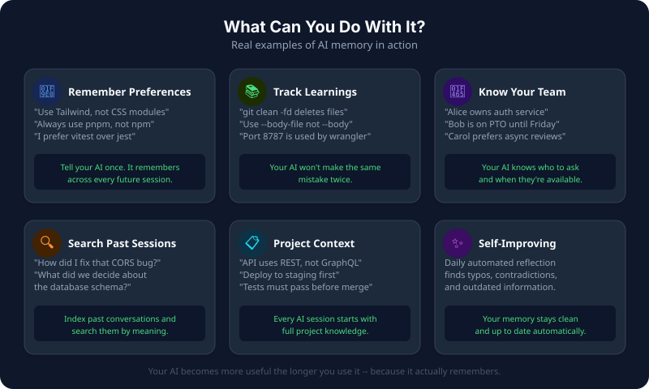
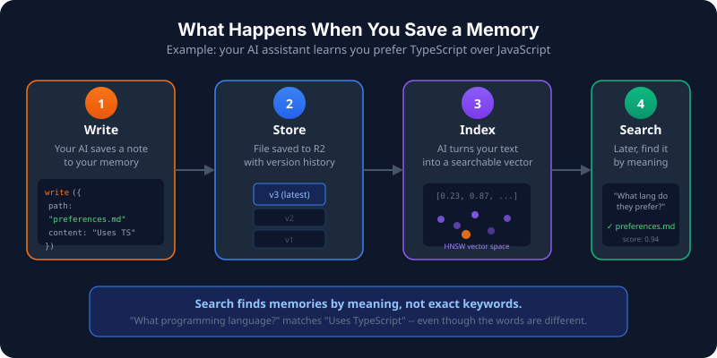
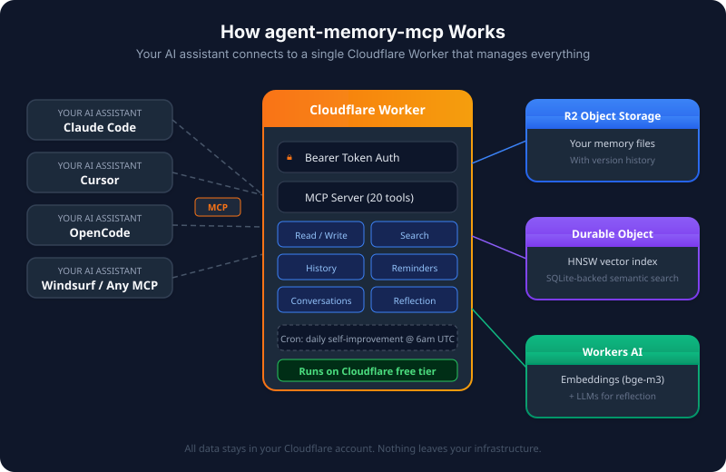

# agent-memory-mcp

**Give your AI coding assistant a long-term memory.**

AI assistants like Claude Code, Cursor, and OpenCode forget everything between sessions. This fixes that. `agent-memory-mcp` is a small server you deploy to your own Cloudflare account that stores memories, searches them by meaning, and keeps them organized -- so your AI gets smarter the longer you use it.

It runs entirely on Cloudflare's free tier. Your data never leaves your account.

[](https://deploy.workers.cloudflare.com/?url=https://github.com/jonnyparris/agent-memory-mcp)

---

## What can you do with it?

<picture>
  <source media="(prefers-color-scheme: dark)" srcset="docs/use-cases.svg">
  
</picture>

**Some real examples:**

- **"Always use pnpm, not npm"** -- Tell your AI once. It remembers in every future session.
- **"How did I fix that CORS bug last week?"** -- Search past conversations by meaning, not keywords.
- **"Alice owns the auth service"** -- Your AI knows who to ask about what.
- **"We decided to use REST, not GraphQL"** -- Project decisions persist across sessions.
- **"Port 8787 is already used by wrangler"** -- Your AI won't make the same mistake twice.

---

## How it works

<picture>
  <source media="(prefers-color-scheme: dark)" srcset="docs/how-it-works.svg">
  
</picture>

1. **Write** -- Your AI saves a note (a preference, a lesson, a decision).
2. **Store** -- The file is saved to R2 with full version history. You can roll back any change.
3. **Index** -- Workers AI turns the text into a vector embedding and adds it to a searchable index.
4. **Search** -- Later, your AI (or you) can find that memory by asking a question in plain English. Semantic search matches by meaning, not exact words.

Recent memories rank higher than old ones automatically.

---

## Architecture

<picture>
  <source media="(prefers-color-scheme: dark)" srcset="docs/architecture.svg">
  
</picture>

Three Cloudflare services, one Worker:

| Component | What it does |
|-----------|-------------|
| **R2** | Stores your memory files with version history |
| **Durable Object** | Runs the HNSW vector index + SQLite for semantic search |
| **Workers AI** | Generates embeddings (bge-m3) and powers the daily reflection |

---

## Quick start

### Option A: One-click deploy

Click the button, follow the prompts, and you'll have a running server in under 2 minutes:

[](https://deploy.workers.cloudflare.com/?url=https://github.com/jonnyparris/agent-memory-mcp)

After deploying, set your auth token:

```bash
npx wrangler secret put MEMORY_AUTH_TOKEN
# Enter a secure random token when prompted
```

### Option B: Clone and deploy manually

```bash
git clone https://github.com/jonnyparris/agent-memory-mcp.git
cd agent-memory-mcp
npm install

# Create your R2 bucket
npx wrangler r2 bucket create agent-memory

# Set your auth token
npx wrangler secret put MEMORY_AUTH_TOKEN
# Enter a secure random token when prompted

# Deploy
npm run deploy
```

---

## Connect your AI assistant

Once deployed, connect your AI assistant to the server. Replace `YOUR_SUBDOMAIN` with your Cloudflare Workers subdomain (find it in the Cloudflare dashboard under Workers & Pages).

### Claude Code

```bash
export MEMORY_AUTH_TOKEN="your-secret-token"
claude mcp add --transport http agent-memory \
  https://agent-memory-mcp.YOUR_SUBDOMAIN.workers.dev/mcp \
  --header "Authorization: Bearer $MEMORY_AUTH_TOKEN"
```

### Cursor

Go to **Settings > MCP Servers > Add**:
- **URL:** `https://agent-memory-mcp.YOUR_SUBDOMAIN.workers.dev/mcp`
- **Headers:** `Authorization: Bearer YOUR_TOKEN`

### OpenCode

Add to `.opencode/opencode.json`:

```json
{
  "mcp": {
    "agent-memory": {
      "type": "remote",
      "url": "https://agent-memory-mcp.YOUR_SUBDOMAIN.workers.dev/mcp",
      "headers": {
        "Authorization": "Bearer {env:MEMORY_AUTH_TOKEN}"
      }
    }
  }
}
```

### Any MCP-compatible client

The server speaks the standard [Model Context Protocol](https://modelcontextprotocol.io/). Any MCP client can connect via HTTP with a Bearer token header.

---

## Available tools

The server exposes 23 MCP tools. Your AI assistant discovers and uses them automatically -- you don't need to call them yourself.

### Core memory

| Tool | What it does |
|------|-------------|
| `read` | Read one file or up to 50 files from memory (pass a string or array of paths) |
| `write` | Save a file (auto-indexes for search; extracts `tags:` frontmatter for filtering). Pass `wait_for_index: false` to defer the embedding update for sub-second response, or `detect_overlaps: false` to skip the post-write similarity search |
| `write_many` | Write up to 50 files in one call. R2 writes run in parallel and embedding updates are issued concurrently; defaults to `detect_overlaps: false` since bulk callers usually know what they're writing |
| `list` | List files in a directory (optionally filter by tags). Each entry carries `size`, `updated_at`, and the R2 `etag` (md5 for simple puts) — a sync client can diff the etag against a local hash to skip re-downloading unchanged files |
| `list_tags` | List all tags with the file count for each |
| `search` | Find memories by meaning (semantic search; optionally filter by tags) |
| `history` | See previous versions of a file |
| `rollback` | Restore a file to an earlier version |
| `get_backlinks` | List files that link to a target via `[[wikilinks]]` |
| `execute` | Run JavaScript queries against your memory ([trust notes](#the-execute-tool)) |

### Conversations

| Tool | What it does |
|------|-------------|
| `index_conversations` | Import past AI sessions for search |
| `search_conversations` | Search across past conversations by meaning |
| `expand_conversation` | Get full context around a search result |
| `conversation_stats` | See how many conversations are indexed |

### Reminders

| Tool | What it does |
|------|-------------|
| `schedule_reminder` | Set a one-time or recurring reminder |
| `check_reminders` | Poll for fired reminders (called on startup) |
| `list_reminders` | List all active reminders |
| `remove_reminder` | Delete a reminder |

### Reflection

| Tool | What it does |
|------|-------------|
| `list_pending_reflections` | See proposed memory improvements |
| `apply_reflection_changes` | Apply a suggested improvement |
| `archive_reflection` | Dismiss a suggestion |

---

## Recommended memory structure

You can organize your memory however you like. Here's a structure that works well:

```
memory/
├── learnings.md        # Lessons learned, gotchas, corrections
├── preferences.md      # Your coding style, tool preferences
├── people.md           # Teammates, roles, availability
├── projects.md         # Active projects, architecture decisions
│
├── patterns/           # Reusable patterns and templates
│   ├── git.md
│   ├── code-review.md
│   └── debugging.md
│
├── workload/           # Current tasks and priorities
│   ├── active.md
│   ├── backlog.md
│   └── archive/
│
└── archive/            # Old context you might need someday
```

---

## Scheduled reflection

Every day at 6am UTC the server reviews your memory and cleans it up. It's a janitor, not an architect (see below).

**1. Hygiene (no model).** Trailing whitespace, runs of blank lines and missing final newlines are fixed with plain code. Fenced code blocks are never touched. Disable with `REFLECTION_HYGIENE="false"`.

**2. Deep analysis (one model, one focus per night).** Reviewing "everything" in one run is too broad for any model you'd run nightly: it reads a few files and runs out of time. So each weekday gets one job, and the model only sees the files that job needs:

| Focus id | Looks for |
|---|---|
| `orphans` | Files that should link to each other; adds short "See also" links |
| `plans` | Finished, abandoned, superseded or duplicate plans and todos |
| `learnings` | Contradictory or duplicated lessons |
| `projects` | Stale project status, contradictions between project notes |
| `people` | Contradictory roles, duplicate people, stale preferences |
| `structure` | Misplaced files, duplicate folders, files that should be split |
| `patterns` | Patterns/reference docs that contradict newer learnings |

The model can **flag** an issue for you (the default) or **edit** a file. Edits are applied automatically, with guards:

- whole-file deletes are never applied; they are flagged
- a `replace` that would drop more than 30% of a file is refused and flagged
- every write snapshots the previous content, so `history`/`rollback` can undo it

**Budgets.** 25 turns and about 11 minutes of wall time (a cron-triggered Worker gets 15). The model is nudged at the halfway mark if it hasn't recorded anything, warned near the end, and its last turn can only record findings or finish. A run that stops early is reported as **incomplete**. It never says "looks good" unless the model actually finished.

**Notifications** go out only when there's something to act on: edits, flags, failures or an incomplete run. There's a weekly heartbeat on Sundays with stats, and an alert if three runs in a row don't finish. Run history is kept in `memory/meta/reflection-runs.json`.

Trigger a run manually:

```bash
curl -X POST "https://your-worker.workers.dev/reflect" \
  -H "Authorization: Bearer YOUR_TOKEN"
```

`?dry_run=1` shows what a run would do without writing anything or notifying. Dry runs also accept `&focus=<id>` and `&model=@cf/...` for trying prompts and models. A run takes 2-12 minutes.

### Choosing a reflection model

Set `REFLECTION_MODEL` in `wrangler.jsonc`. The default was picked by dry runs against a real 1,300-file memory store (2026-09-25, `plans` focus):

| Model | Result | Time |
|---|---|---|
| `@cf/deepseek-ai/deepseek-v4-flash-0731` | Finished, 11 specific findings, all spot-checked correct | 13 min at 25 turns (now capped at ~11) |
| `@cf/openai/gpt-oss-120b` | Finished, 1 finding | 2 min |
| `@cf/google/gemma-4-26b-a4b-it` | Ran out of turns, 2 findings (finishes on narrower focuses) | 3 min |
| `@cf/nvidia/nemotron-3-120b-a12b` | Ran out of turns, 3 findings | 4 min |
| `@cf/qwen/qwen3.8-27b` | Request timeout | - |
| `@cf/zai-org/glm-5.3`, `glm-5.3-flash` | Over 15 minutes | - |
| `@cf/moonshotai/kimi-k2.6` | Unusable: emits tool calls as text inside `reasoning_content` | - |

DeepSeek costs more per token than Gemma ($0.44 vs $0.10 per million input tokens), but most of a run's input is cached ($0.014/M). Expect cents per night. For the cheapest setup that still works, use Gemma 4.

### What the scheduled reflection is *not*

The cron-driven reflection is a narrow, autonomous scan. It runs unattended on a fixed budget and records each run in `memory/reflections/archive/{date}.md` (plus a `.json` sidecar).

This is **not the same as** a deep reflection workflow you might drive from your agent — e.g. a `/nightly-reflect` slash command that pulls your entire week of activity (calendar, git log, scratch notes, chat history) and writes a multi-section improvement plan. The cron has none of that context. It only sees what's already in memory.

Concretely:

- **Cron output** lives in `memory/reflections/pending/` and `memory/reflections/archive/`. Expect terse summaries and small auto-fixes.
- **Agent-driven deep reflection output** should live somewhere else (e.g. `memory/workload/plans/{date}-improvement-proposals.md`). Don't conflate the two — a healthy `memory/reflections/archive/` does not mean your weekly reflection ran.

If your agent has a separate deep-reflection workflow, watch its output directory directly. The cron is a janitor; the agent is the architect.

---

## The `execute` tool

The `execute` tool runs arbitrary JavaScript against your memory. It's fast and convenient for complex queries (group files by tag, aggregate word counts, etc.) but it's **not a sandbox**:

- Code runs in the same V8 isolate as the Worker.
- It has access to global `fetch`, `crypto`, and other Web APIs.
- It runs with the Worker's CPU limit as the only time bound (plus a 10s wall-clock timeout from the tool).
- It does NOT have access to `env` bindings, your auth token, or other secrets — those never touch the global scope.

Guidance:

1. Only use `execute` when you trust who's calling it. The auth token protects the MCP endpoint; anyone with the token can run code.
2. Don't expose this MCP to untrusted users without stripping the `execute` tool first.
3. Use `search` + `read` instead when you can — they're safer and usually faster.

---

## Cost

Runs entirely within Cloudflare's free tier for personal use:

| Service | Free tier limit | Typical usage | Cost |
|---------|----------------|---------------|------|
| R2 Storage | 10 GB/month | ~1 MB | $0 |
| R2 Operations | 10M reads, 1M writes | ~3K reads, ~600 writes | $0 |
| Workers | 10M requests/month | ~6K | $0 |
| Workers AI | 10K neurons/day | embeddings + nightly reflection | $0-5 |
| Durable Objects | 100K requests/day | ~200 | $0 |

**Total: $0-5/month.** Embeddings fit in the free tier. The nightly reflection with the default model can go past it; switch `REFLECTION_MODEL` to Gemma 4 to stay close to free.

---

## Development

```bash
npm install       # Install dependencies
npm run dev       # Run locally
npm test          # Run all tests
npm run test:unit # Unit tests only
npm run deploy    # Typecheck, lint, test, then deploy
```

`npm run deploy` runs the checks before deploying. Set `STRICT_DEPLOY=1` in `.env` to also refuse deploys from anything but a clean, up-to-date `main` (`ALLOW_BRANCH_DEPLOY=1` overrides for testing a branch). If your Cloudflare login can see several accounts, set `CLOUDFLARE_ACCOUNT_ID` in `.env` too.

### Migrating existing memory files

If you have local memory files you want to upload:

```bash
npm run migrate   # Upload local files to your deployed server
npm run export    # Download all files from the server to local disk
```

---

## License

MIT
